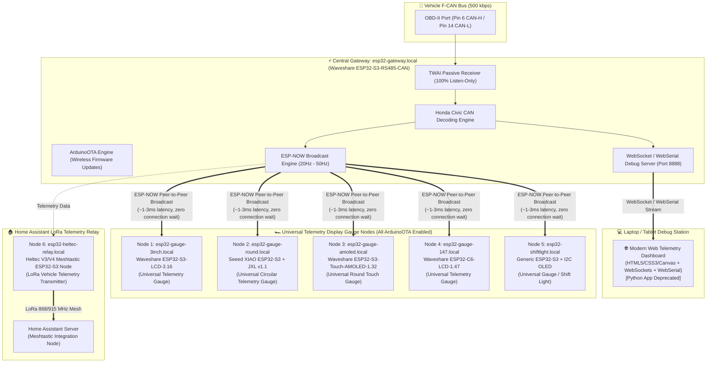

# Implementation Plan: espDash - Distributed Automotive Telemetry System

This implementation plan outlines the architecture for **espDash**, a distributed, low-latency, car-safe automotive telemetry network and web dashboard for the **2014 Honda Civic**. A central ESP32-S3 CAN Gateway captures vehicle bus data, broadcasts it using **ESP-NOW (~1-3ms latency)** to multiple display nodes, and serves a **Concurrent WebSocket / WebSerial Debug Channel** to a modern **Web Telemetry Dashboard**. 

Every node in the network features **Wireless ArduinoOTA / WebOTA** firmware updating capability.

---

## 🏛️ System Architecture Diagram



---

## 📶 Multi-Network Wi-Fi & Credentials Specification

Every node incorporates **WiFiMulti** to automatically connect to whatever network is present:

| Network SSID | Password | Network Role / Location |
| :--- | :--- | :--- |
| **`Complex_parking`** | `12345678` | Garage / Parking Lot Network |
| **`Bazanski_ph`** | `52288488` | Mobile Phone Hotspot |
| **`Bazanski_IS`** | `52288488` | Home Network |
| **`IOT-monday`** | `fsdL2Dp*KBU0y#9F&c!Zbq853axj` | Office / Fallback Network |

* **Zero Disassembly Firmware Flashing:** Flash any gauge mounted in the vehicle dashboard wirelessly over Wi-Fi (`Complex_parking`, `Bazanski_ph`, `Bazanski_IS`, or `IOT-monday`) without removing trims or unplugging USB cables!

---

## 📁 Workspace Consolidation (`/Users/kickoff_laptop/Developer/espDash`)

The project is consolidated into a dedicated standalone workspace at `/Users/kickoff_laptop/Developer/espDash`:

```text
/Users/kickoff_laptop/Developer/espDash/
├── README.md
├── AGENTS.md
├── CLAUDE.md
├── docs/
│   ├── ARCHITECTURE.md
│   ├── CAN_PROTOCOL_MAP.md
│   ├── OTA_UPDATE_GUIDE.md
│   └── IMPLEMENTATION_PLAN.md
├── firmware/
│   ├── esp32-gateway/           # Central ESP32-S3 CAN Gateway Firmware
│   └── display-nodes/           # Universal gauge display node firmware
└── web-dashboard/               # HTML5/JS Web Telemetry Dashboard
```

---

## 🔄 Proposed Development & Rollout Phases

- [x] **Phase 0 (Workspace & Documentation Setup):** Create `/Users/kickoff_laptop/Developer/espDash` workspace, populate Wi-Fi credentials (`IOT-monday`), and save full documentation.
- [ ] **Phase 1 (Gateway ESP-NOW & WebSockets Firmware):** Port gateway firmware with concurrent ESP-NOW broadcasting and WebSocket/WebSerial streaming.
- [ ] **Phase 2 (Modern Web Telemetry Dashboard App):** Build the HTML5/JS Web Dashboard with WebSockets & WebSerial support.
- [ ] **Phase 3 (Universal Display Gauges & ArduinoOTA):** Implement universal display node firmware for 3.16" LCD, Round JXL, AMOLED 1.32", ESP32-C6 LCD 1.47", and OLED shift light with ArduinoOTA enabled.
- [ ] **Phase 4 (Heltec Meshtastic Home Assistant Relay):** Build Heltec ESP32-S3 bridge to send vehicle status over LoRa Mesh to Home Assistant.
